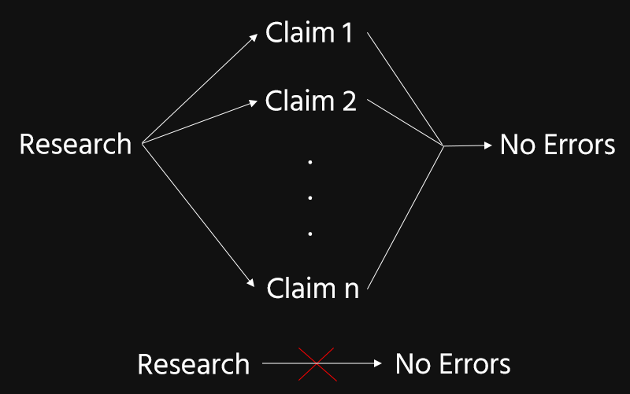

# Four Paradoxes

## The Preface

> Suppose that in the course of his book a writer makes a great many assertions... Given each one of these, he believes that it is true... he may also believe that not everything he has written in his latest book is true... However, to say that not everything I assert in this book is true, is to say that at least one statement in this book is false. (Makinson 1965)

## Bootstrapping

But imagine now our author isn't so modest. Instead he notes that the first sentence in his book is true. And the second, and the third. "Hey!", he thinks, "I'm doing really well." He begins to suspect he's actually more reliable than he previously thought.

---

Some background:

- Bootstrapping is often viewed as a problem for externalist theories of knowledge/justification, like reliabilism.
    - Roxanne and her gas gauge.
- But internalists face the problem, too: see above.
    - The difference is just a matter of degree.

## Harman-Vogel

> ...it seems natural to deny that a person can know... that his ticket in a fair million-to-one lottery will not win. However... I might know that I am meeting a friend for lunch tomorrow... even if I also know that his being there would be incompatible with his having won the lottery... if we try to deduce that the lottery ticket will not win from our expectation of the lunch meeting, we get the feeling that we no longer know the lunch proposition, or perhaps never did know it. (Nagel 2011)

---

Example:

1. I remember parking my car on Avenue A an hour ago.
1. So my car is on Avenue A.
2. So it hasn't been stolen and moved to Avenue B.

## Dogmatism

> If I know that *h* is true, I know that any evidence against *h* is evidence against something that is true; so I know that such evidence is misleading. But I should disregard evidence that I know is misleading. So, once I know that *h* is true, I am in a position to disregard any future evidence that seems to tell against *h*. (Harman 1973)

---

Example:

1. I remember parking my car on Avenue A an hour ago.
1. So my car is on Avenue A.
2. So if Doug reports that my car is not on Avenue A, his report is misleading.

# Accepting Acceptance

## Two Models of Belief

1. Credence: belief as a matter of degree.
    - The Bayesian's conception of belief.
2. Acceptance: belief as an on/off state.
    - Everyone else.

## JDM Research

Four decades of proposals that rely on categorical inputs:

- 1970's: the availability and representativeness heuristics (Kahneman & Tversky)
- 1980's and 90's: the adaptive toolbox (Gigerenzer, Payne *et al*)
- 2000’s: the evidence accumulation model (Lee & Cummins)

## Cognitive Closure

Cognitive Closure: the closing of one's mind on a question.

> the juncture at which a belief crystallizes and turns from hesitant
conjecture to a subjectively firm "fact." (Kruglanski & Webster 1996)

- The Need for Closure Scale
- Seizing & Freezing

## Dualism

My view: we have two kinds of belief, one graded and one categorical.

- We epistemologists need to learn how to make them play nice together.

# Intransitive Chains

## Probabilification

Suppose we choose a Canadian citizen at random.

- Most Canadian citizens reside in North America.
- Most residents of North America are U.S. citizens.
- Still, our chosen Canadian will probably not be a U.S. citizen.

## Probabilification & Entailment

Suppose I draw a random card from a normal deck.

- If it's a spade, the chance it's the ace of spades has gone up.
- If it's the ace of spades, it must be an ace.
- Still, its being a spade has no bearing on its being an ace.

## "Clipping"

- $E = K$: one's evidence is just what one knows. (Williamson 2000)
    - The "Wrong Way" Objection
    - The Bootstrapping Objection (Neta 2008)
    - Bacon 2014?

## The Connection

Intuitively, "clipping" is what's going on in the Preface.

- Ditto for the bootstrapping objection to reliabilism.
- And bootstrapping, qua paradox, just looks like a milder case of the same dysfunction.
- So let's run with it?

# Intransitivity & Paradox

---

Each of our paradoxes features initial conclusions that are reasonable.

- Those conclusions would ordinarily support further conclusions.
    - But not in these paradoxical cases.
- Trying to barrel ahead anyway induces a shift.
    - from acceptance to mere high confidence.

## The Preface

## Bootstrapping

## Harman-Vogel

## Dogmatism

## The Moral

My conclusion: propositional justification is intransitive.

- Sometimes $A$ supports $B$, $B$ supports $C$, yet $A$ doesn't supports $C$.
- Concluding $B$ from $A$ results in doxastically justfied belief in $B$.
- But a further inference from $B$ to $C$ does not result in a doxastically justied belief in $C$.

---

A justified belief's "inferential reach" is source- and target-dependent.

- Where did that belief get its justification?
- Does that source support the conclusion of the present inference?

# Awkward Pauses

## That Other Kind of Closure

**Deductive Closure**

:    If you are justified in believing $P$, and you competently deduce $Q$ from $P$, your belief in $Q$ is thereby justified.

## Cohen's Objection

1. The card looks red.
2. So it is red.
3. So the card looks red and is red.
4. So the card's apparent colour matches its actual colour.

My view prohibits the last step: "a particularly jarring instance of the failure of deductive closure" (Cohen 2010).

## Nagel's Insight

> While I am dwelling on my inability to rule out the possibility that my car has been stolen, and 
engaging 
in 
controlled 
cognition 
on 
the 
question 
of 
its
 whereabouts,
 I 
can 
no 
longer 
automatically 
judge 
it 
to 
be 
parked 
on 
Avenue 
A 
in
 the 
manner 
that
 might 
earlier 
have 
manifested 

knowledge. (Nagel 2011)

## The Importance of Switching

In considering the move from (3) to (4), a rational agent will switch from overt acceptance to mere high credence.

- With the appearance-reality link in question, the "clipped" possibilities come back.

If you plow ahead anyway and judge that (3) and therefore (4), your judgment that (3) does not manifest a justified belief.

- You may have a justified (dispositional) belief in (3).
    - But this occurrent judgment is no manifestation of it.

## Open Question

When exactly are we obliged to switch from overt acceptance to mere high credence.

- *And when are we permitted to switch back*?
